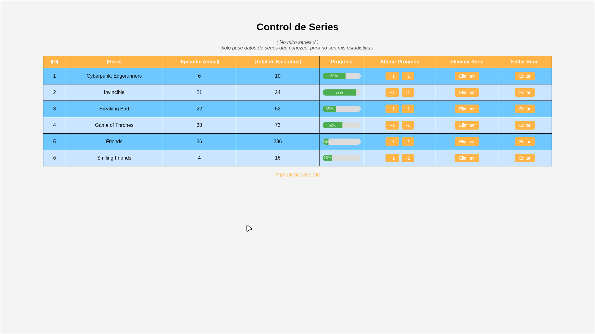
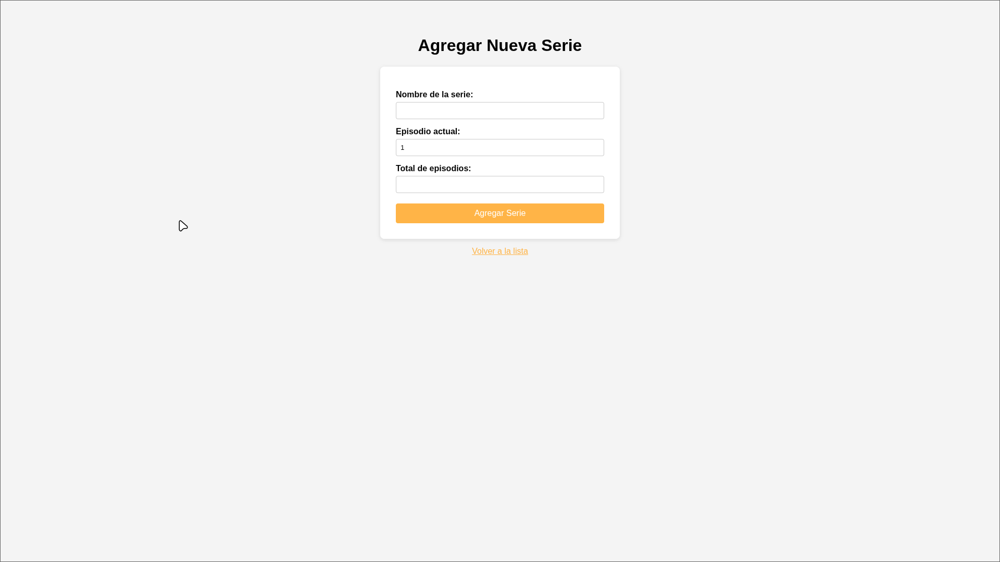

# Control de Series 📺

Servidor HTTP hecho en Go desde cero (sin frameworks) con SQLite como base de datos.

## Screenshot

### Página Principal



### Página de Agregar una Nueva Serie



## Cómo correr el proyecto

### Requisitos
- Go 1.21+
- El módulo `modernc.org/sqlite` (pure Go, no necesita CGO)

### Instalación

```bash
git clone <https://github.com/MarceloDetlefsen/lab5-web.git>
cd <lab5-web>
go mod tidy
go run .
```

Abrí el navegador en `http://localhost:8080`

### Estructura del proyecto

```
.
├── main.go        # Arranque del servidor, conexión a DB y loop de conexiones
├── handlers.go    # Routing y lógica de cada endpoint
├── templates.go   # HTML, CSS y JavaScript
├── series.db      # Base de datos SQLite
└── README.md
```

## Endpoints

| Método   | Ruta            | Descripción                        |
|----------|-----------------|------------------------------------|
| GET      | `/`             | Página principal con tabla         |
| GET      | `/create`       | Formulario para agregar serie      |
| POST     | `/create`       | Insertar nueva serie en la DB      |
| POST     | `/update?id=X`  | Incrementar episodio actual (+1)   |
| POST     | `/update-minus?id=X` | Decrementar episodio actual (-1) |
| DELETE   | `/delete?id=X`  | Eliminar serie                     |
| PUT      | `/edit?id=X`    | Editar nombre y episodios          |

## Challenges implementados

| Challenge | Puntos |
|-----------|--------|
| Estilos y CSS | 10 |
| Código Go ordenado en archivos (`main.go`, `handlers.go`, `templates.go`) | 15 |
| Barra de progreso (episodios vistos vs total) | 15 |
| Marcar serie como completada con texto especial | 10 |
| Botón -1 para decrementar episodio | 10 |
| Función para eliminar serie con método DELETE | 20 |
| Editar serie con método PUT | 25 |
| Ordenar por columna (nombre, episodio actual, total) | 20 |

**Total: 125 puntos**

## Detalles técnicos

- El servidor HTTP está implementado **desde cero** usando `net.Conn`, sin usar `net/http`
- Se parsean manualmente la request line, headers y body
- El body de POST/PUT se lee usando `Content-Length` para saber exactamente cuántos bytes leer
- Se usa el patrón **POST/Redirect/GET** en `/create` para evitar reenvíos del formulario
- Las operaciones de JS (editar inline, +1, -1, eliminar) usan `fetch()` sin recargar la página, excepto al confirmar cambios
- El ordenamiento por columna es **client-side** con JS, detectando automáticamente si el valor es numérico o texto
- La edición inline convierte los `<td>` en `<input>` directamente en el DOM sin navegar a otra página

## 👨‍💻 Autor

Marcelo Detlefsen - 24554